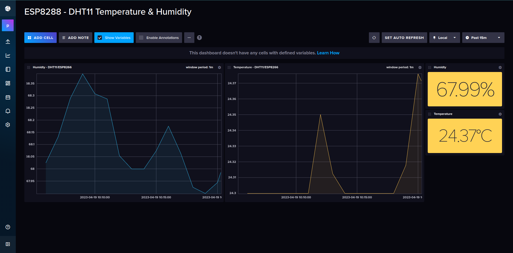

# arduino-playground

Collection of Arduino projects, sketches, ideas, and experiments, together with few infrastructure components, such as
databases, and dashboards.

These won't relly on Firebase, Blynk, etc. but on open-source self-hosted components, such as influxdb, grafana, etc.
either running in cloud, or locally.

## Arduino UNO R3 Board

**TODOS**

* [ ] Add list of projects

### 1.1 Starter Kit Projects

## 2. NodeMCU ESP8266 Board

#### 2.2. ESP8266  Web Server

#### 2.2. ESP8266 with a DHT11 Sensor

Sketch:

    src/nodemcu-esp8266-humidity-sensor.ino    

Infrastructure: influxdb

    infrastructure/influxdb/docker-compose.yml

Sample ino sketch for NodeMCU (ESP8266) board, for reading temperature and humidity from a DHT11 sensor.

It will connect to wifi, and send the read sensor values to
an influxdb running locally (on my laptop) within a docker container, exposed on port 8086, within the same network.

**What you'll need:**
* docker
* docker-compose
* NodeMCU board
* DHT11 sensor
* Arduino IDE libraries
    * `DHT sensor library` lib `1.3.4` by Adafruit
    * `Adafruit Unified Sensor` lib `1.0.3` by Adafruit

**How it looks:**

**TODOS**
* [X] Connect DHT11 sensor to NodeMCU board
* [X] Connect NodeMCU to wifi
* [X] Read sensor values
* [X] Send sensor values to influxdb
* [X] Create influxdb dashboard with humidity and temperature values

* [ ] Add guide how to run influxdb locally
* [ ] Add rest of prerequisites to the above list
* [ ] Detailed steps for setting up everything and running it